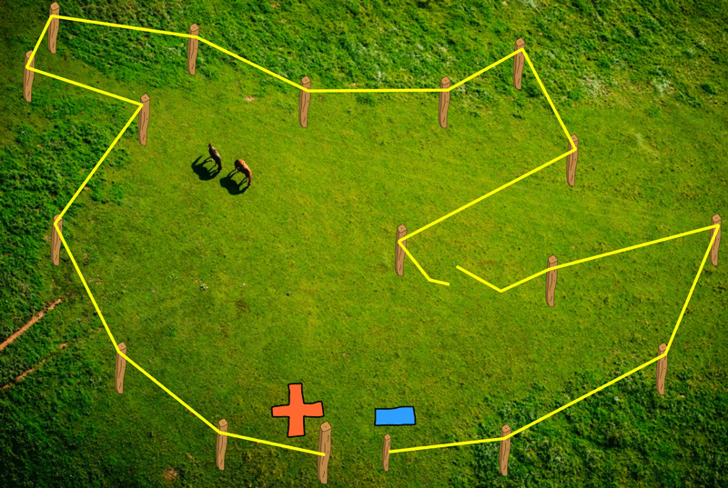
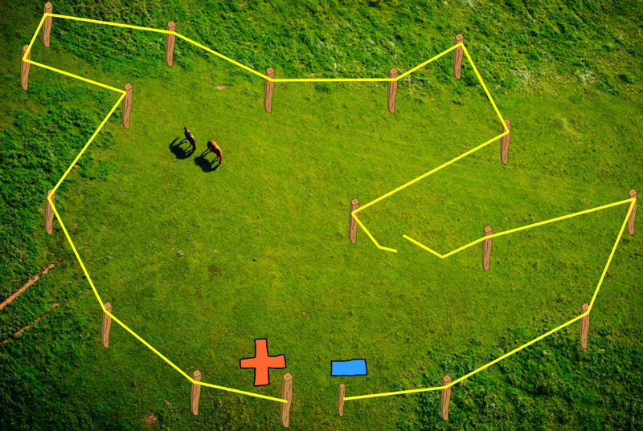
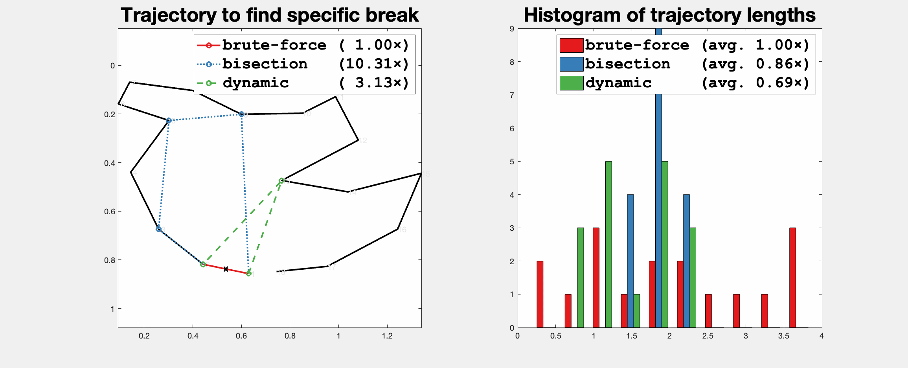

# Electric fence repair problem


_Inspired by the [Manhattan
eruv](https://en.wikipedia.org/wiki/Yosef_Eliyahu_Henkin#Manhattan_eruv)._



Suppose that you have an electric fence in the form of a wire polygon with fence
posts as corners. There's been exactly one break in the wire somewhere unknown.
To find which segment of the wire polygon is broken, one solution is to walk the
entire perimeter of the polygon. Naturally the worst case requires walking
$\sum\limits_{i=1}^n \ell_i$ distance for a fence with $n$ segments. If we expect that
the break could be anywhere along the fence with uniform probability, then the
expected distance traveled for this **brute force method** to find the break will be
$\frac{1}{2} \sum\limits_{i=1}^n \ell_i$.

Utilizing the conduction of the fence, a different solution would be to travel
to the midpoint of the fence and connect a positive charge. If the charge
completes the circuit then we know the break is _behind_ this point along the
fence, otherwise the break remains _beyond_ this point along the fence.
Recording this information then splitting the side with the break recursively,
this [**bisection method**](https://en.wikipedia.org/wiki/Bisection_method) will
find the break in $O(\log n)$ _tests_. However, the distance traveled to perform
each of these tests can be as long or even longer than simply walking the entire
perimeter.



For example, if the fence is a unit meter circle, then the brute force method travels
worst case 2π meters and on average π meters. The bisection method always
travels the same distance regardless of where the break is: ≈4.9620998 meters ($2+ \sqrt{2} + \sqrt{2-\sqrt{2}} + \sqrt{2 - \sqrt{\sqrt{2} + 2}} + \dots$).

On the other hand, for an extreme star-shaped polygon where every other point is
placed on the unit meter circle then the origin, bisection will only visit the origin
points and then one final point on the circle, thus traveling 1 meter. Where as
the brute-force method will travel n meters on average. We could pathologically
drive n→∞.

Can we do better than bisection or brute force?

## Dynamic Programming

Suppose that we have access
to a function `cost(i,k)` which returns the expected distance traveled
to find a break drawn with uniform probability between fence-posts `i` and
`k`. We can define `cost` recursively as:

```
cost(i,k) = /   0                                                        if k-i = 1,
            |  ℓ_ij + min (ℓ_ij/ℓ_ik) cost(i,j) + (ℓ_jk/ℓ_ik) cost(j,k)  otherwise.
            \        i<j<k
```

where `ℓ_ik` is the arc-length (sum of edge lengths) from fence-post `i` to `k`,
so that `(ℓ_ij/ℓ_ik)` and `(ℓ_jk/ℓ_ik)` sum to one and are the relative
probabilities of the break occurring on either side of `j`.

This function may be defined using dynamic programming to fill the upper triangle
of a table `cost_ik` for all `i<k` while recording the optimal `j` fence-posts
along the way.


While this does require $O(n^2)$ _computer operations_ to fill in, the
distance traveled along the determined route will be optimally small _on average_.

Sometimes the distance is worse than bisection or brute force for a given instance (e.g., brute force will
immediately find a break a segment from the start).  I'm not sure if this worst-case performance can be improved.


## Code

The matlab code in this repo implements these three algorithms.
`test_broken_circuit` computes the histogram of finding breaks on all input
edges and computes their probability weights means.




_Thanks to the Banh-mi Lab Group Meeting for helping work through this problem.
Especially Abhishek who first proposed the complete dynamic
programming solution._
